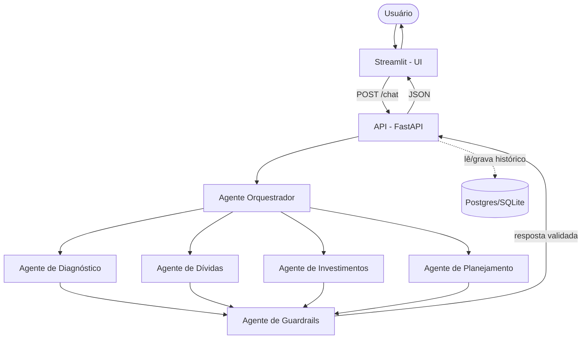

# Arquitetura

## Visão geral

O sistema é dividido em três camadas desacopladas: **frontend** (Streamlit),
**API** (FastAPI) e **núcleo de agentes** (LangGraph). O frontend nunca fala
diretamente com os agentes — toda a comunicação passa pela API, o que permite
trocar a interface (web, mobile, WhatsApp) sem tocar na lógica de negócio.

## Papel de cada agente

| Agente | Responsabilidade | Nunca faz |
|---|---|---|
| Orquestrador | Interpreta a intenção do usuário e roteia para o(s) especialista(s) certo(s) | Responder diretamente perguntas de domínio |
| Diagnóstico | Organiza a situação financeira relatada (renda, gastos, dívidas) | Dar conselhos de investimento |
| Dívidas | Explica estratégias de quitação (bola de neve, avalanche, renegociação) | Indicar credor ou instituição específica |
| Investimentos | Educa sobre conceitos (renda fixa/variável, perfil de risco, tesouro direto, FIIs) | Recomendar ativo/ticker específico |
| Planejamento | Ajuda a estruturar metas e reserva de emergência | Prometer retorno ou prazo de resultado |
| Guardrails | Audita a resposta de qualquer agente antes de liberar ao usuário | Deixar passar recomendação específica de investimento |

## Fluxo de uma requisição

1. Usuário envia mensagem no Streamlit
2. Streamlit faz `POST /chat` na API com a mensagem e o `session_id`
3. FastAPI valida o payload (Pydantic), lê o histórico da sessão no banco e
   invoca o grafo LangGraph
4. O orquestrador decide qual(is) especialista(s) acionar
5. O(s) especialista(s) geram a resposta
6. O agente de guardrails audita a resposta (bloqueia recomendações específicas)
7. A API grava a troca (pergunta + resposta) no banco e devolve o resultado em JSON
8. O Streamlit renderiza no chat

## Decisões de design

- **API como camada intermediária**: desacopla frontend de lógica de negócio,
  permite escalar/deployar cada camada separadamente.
- **Guardrails como agente dedicado**: em vez de confiar só no prompt de cada
  especialista, existe uma camada de auditoria explícita — decisão de
  governança, não só de engenharia.
- **Sem recomendação de ativo específico**: restrição de produto, reforçada em
  prompt E em guardrail (defesa em profundidade).
- **Fábrica de LLM (`llm_factory.py`)**: o provedor (OpenAI/Anthropic/Groq) é
  escolhido por variável de ambiente, não hardcoded — nenhum agente precisa
  mudar para trocar de modelo.
- **Camada de repositório (`repository.py`)**: isola o resto do código dos
  detalhes do SQLAlchemy — trocar SQLite por Postgres não exigiu mudar a API
  nem os agentes, só a variável `DATABASE_URL`.

## Stack

- **Orquestração**: LangGraph
- **LLM**: OpenAI (padrão), com suporte a Anthropic e Groq via fábrica de
  provedor (`LLM_PROVIDER` no `.env`)
- **API**: FastAPI + Pydantic
- **Frontend**: Streamlit
- **Persistência**: SQLite em desenvolvimento · Postgres (Supabase, via
  connection pooler em modo transaction) em produção
- **Deploy**: API na Render (free tier) · Frontend no Streamlit Community
  Cloud · Banco de dados no Supabase

## Notas de operação (aprendidas no deploy)

- O connection pooler do Supabase precisa ser usado em vez da conexão direta
  ao Postgres — a Render não tem saída IPv6 habilitada, e a conexão direta do
  Supabase resolve para um endereço IPv6.
- O parâmetro `?pgbouncer=true` (usado por alguns ORMs) não é reconhecido pelo
  driver `psycopg2` e precisa ser removido da `DATABASE_URL`.
- Projetos gratuitos do Supabase são pausados após 7 dias de inatividade — é
  preciso reativar manualmente pelo painel antes de uma demonstração após um
  período parado.
- A API na Render (free tier) "dorme" após um tempo sem tráfego — a primeira
  requisição depois disso pode levar 30-50s para responder.