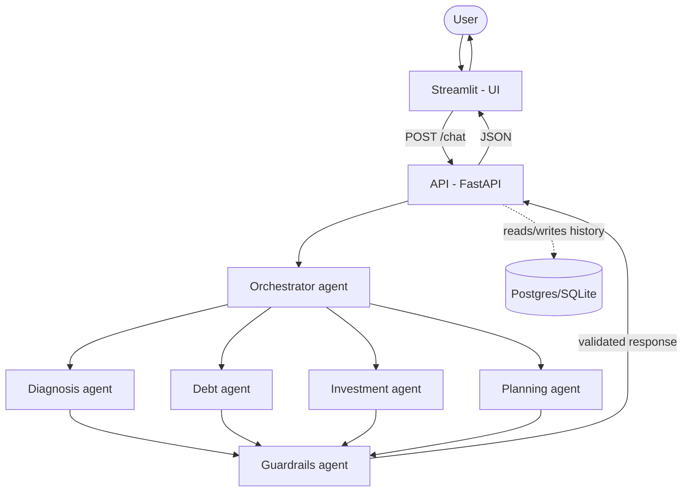

# Arquitetura

> 🇬🇧 *An English version of this document is available [below](#architecture-en).*

## Visão geral

O sistema é dividido em três camadas desacopladas: **frontend** (Streamlit),
**API** (FastAPI) e **núcleo de agentes** (LangGraph). O frontend nunca fala
diretamente com os agentes — toda a comunicação passa pela API, o que permite
trocar a interface (web, mobile, WhatsApp) sem tocar na lógica de negócio.

## Papel de cada agente

| Agente | Responsabilidade | Nunca faz |
|---|---|---|
| Orquestrador | Interpreta a intenção do usuário e roteia para o(s) especialista(s) certo(s) | Responder diretamente perguntas de domínio |
| Diagnóstico | Organiza a situação financeira relatada (renda, gastos, dívidas) | Dar conselhos de investimento |
| Dívidas | Explica estratégias de quitação (bola de neve, avalanche, renegociação) | Indicar credor ou instituição específica |
| Investimentos | Educa sobre conceitos (renda fixa/variável, perfil de risco, tesouro direto, FIIs) | Recomendar ativo/ticker específico |
| Planejamento | Ajuda a estruturar metas e reserva de emergência | Prometer retorno ou prazo de resultado |
| Guardrails | Audita a resposta de qualquer agente antes de liberar ao usuário | Deixar passar recomendação específica de investimento |

## Fluxo de uma requisição

1. Usuário envia mensagem no Streamlit
2. Streamlit faz `POST /chat` na API com a mensagem e o `session_id`
3. FastAPI valida o payload (Pydantic), lê o histórico da sessão no banco e
   invoca o grafo LangGraph
4. O orquestrador decide qual(is) especialista(s) acionar
5. O(s) especialista(s) geram a resposta
6. O agente de guardrails audita a resposta (bloqueia recomendações específicas)
7. A API grava a troca (pergunta + resposta) no banco e devolve o resultado em JSON
8. O Streamlit renderiza no chat

## Decisões de design

- **API como camada intermediária**: desacopla frontend de lógica de negócio,
  permite escalar/deployar cada camada separadamente.
- **Guardrails como agente dedicado**: em vez de confiar só no prompt de cada
  especialista, existe uma camada de auditoria explícita — decisão de
  governança, não só de engenharia.
- **Sem recomendação de ativo específico**: restrição de produto, reforçada em
  prompt E em guardrail (defesa em profundidade).
- **Fábrica de LLM (`llm_factory.py`)**: o provedor (OpenAI/Anthropic/Groq) é
  escolhido por variável de ambiente, não hardcoded — nenhum agente precisa
  mudar para trocar de modelo.
- **Camada de repositório (`repository.py`)**: isola o resto do código dos
  detalhes do SQLAlchemy — trocar SQLite por Postgres não exigiu mudar a API
  nem os agentes, só a variável `DATABASE_URL`.

## Stack

- **Orquestração**: LangGraph
- **LLM**: OpenAI (padrão), com suporte a Anthropic e Groq via fábrica de
  provedor (`LLM_PROVIDER` no `.env`)
- **API**: FastAPI + Pydantic
- **Frontend**: Streamlit
- **Persistência**: SQLite em desenvolvimento · Postgres (Supabase, via
  connection pooler em modo transaction) em produção
- **Deploy**: API na Render (free tier) · Frontend no Streamlit Community
  Cloud · Banco de dados no Supabase

## Notas de operação (aprendidas no deploy)

- O connection pooler do Supabase precisa ser usado em vez da conexão direta
  ao Postgres — a Render não tem saída IPv6 habilitada, e a conexão direta do
  Supabase resolve para um endereço IPv6.
- O parâmetro `?pgbouncer=true` (usado por alguns ORMs) não é reconhecido pelo
  driver `psycopg2` e precisa ser removido da `DATABASE_URL`.
- Projetos gratuitos do Supabase são pausados após 7 dias de inatividade — é
  preciso reativar manualmente pelo painel antes de uma demonstração após um
  período parado.
- A API na Render (free tier) "dorme" após um tempo sem tráfego — a primeira
  requisição depois disso pode levar 30-50s para responder.

---

# Architecture (EN)

> 🇧🇷 *A versão em português está [acima](#arquitetura).*

## Overview

The system is split into three decoupled layers: **frontend** (Streamlit),
**API** (FastAPI), and the **agent core** (LangGraph). The frontend never
talks to the agents directly — every interaction goes through the API, which
means the interface (web, mobile, WhatsApp) can be swapped without touching
business logic.

## Each agent's role

| Agent | Responsibility | Never does |
|---|---|---|
| Orchestrator | Interprets user intent and routes to the right specialist(s) | Answer domain questions directly |
| Diagnosis | Organizes the user's reported financial situation (income, expenses, debts) | Give investment advice |
| Debt | Explains payoff strategies (snowball, avalanche, renegotiation) | Point to a specific creditor or institution |
| Investment | Teaches concepts (fixed/variable income, risk profile, government bonds, REITs) | Recommend a specific asset/ticker |
| Planning | Helps structure goals and an emergency fund | Promise a return or a timeframe for results |
| Guardrails | Audits any agent's response before it reaches the user | Let a specific investment recommendation through |

## Request flow

1. The user sends a message in Streamlit
2. Streamlit makes a `POST /chat` call to the API with the message and `session_id`
3. FastAPI validates the payload (Pydantic), reads the session's history from
   the database, and invokes the LangGraph graph
4. The orchestrator decides which specialist(s) to call
5. The specialist(s) generate the response
6. The guardrails agent audits the response (blocking specific recommendations)
7. The API persists the exchange (question + answer) to the database and
   returns the result as JSON
8. Streamlit renders it in the chat

## Design decisions

- **API as a middle layer**: decouples frontend from business logic, and lets
  each layer scale/deploy independently.
- **Guardrails as a dedicated agent**: rather than relying only on each
  specialist's prompt, there's an explicit audit layer — a governance
  decision, not just an engineering one.
- **No specific asset recommendations**: a product constraint enforced both
  in the prompt AND in the guardrail (defense in depth).
- **LLM factory (`llm_factory.py`)**: the provider (OpenAI/Anthropic/Groq) is
  chosen via environment variable rather than hardcoded — no agent needs to
  change to switch models.
- **Repository layer (`repository.py`)**: isolates the rest of the codebase
  from SQLAlchemy details — swapping SQLite for Postgres required no changes
  to the API or the agents, just the `DATABASE_URL` variable.

## Stack

- **Orchestration**: LangGraph
- **LLM**: OpenAI (default), with Anthropic and Groq support via a provider
  factory (`LLM_PROVIDER` in `.env`)
- **API**: FastAPI + Pydantic
- **Frontend**: Streamlit
- **Persistence**: SQLite in development · Postgres (Supabase, via a
  transaction-mode connection pooler) in production
- **Deploy**: API on Render (free tier) · Frontend on Streamlit Community
  Cloud · Database on Supabase

## Operational notes (learned during deployment)

- Supabase's connection pooler has to be used instead of the direct Postgres
  connection — Render doesn't have IPv6 egress enabled, and Supabase's direct
  connection resolves to an IPv6 address.
- The `?pgbouncer=true` parameter (used by some ORMs) isn't recognized by the
  `psycopg2` driver and needs to be removed from `DATABASE_URL`.
- Free Supabase projects are paused after 7 days of inactivity — they need to
  be manually reactivated from the dashboard before a demo after a quiet
  period.
- The Render free-tier API "sleeps" after a period without traffic — the
  first request afterward can take 30-50s to respond.