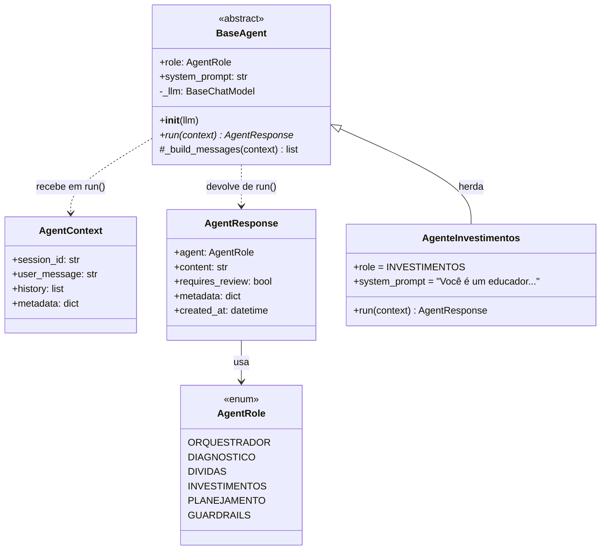
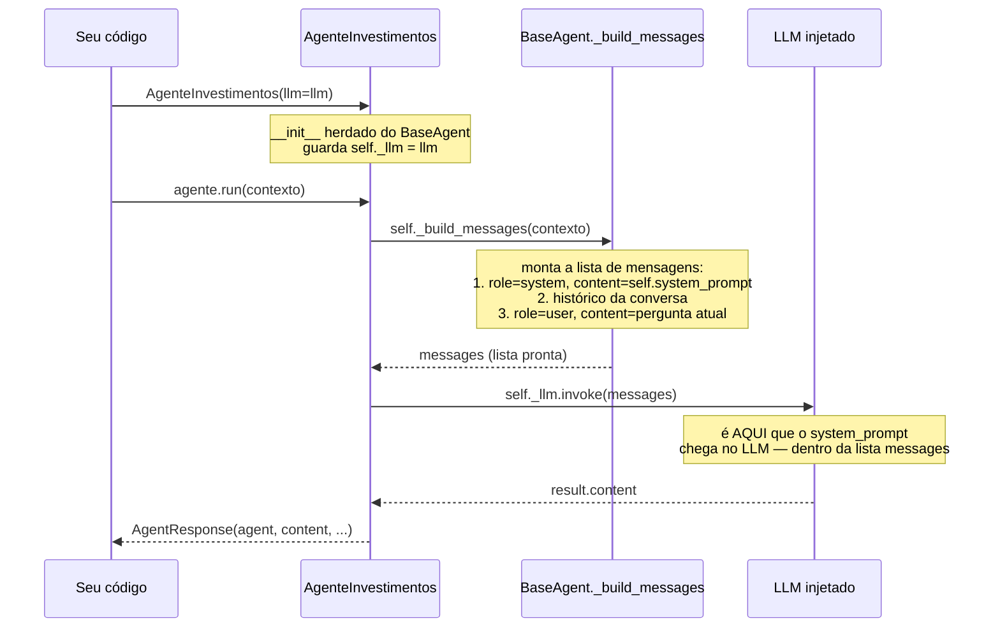

# Classes base — estrutura e fluxo

## Estrutura (quem herda de quem, quem usa quem)

**Como ler:** `BaseAgent` é abstrata (nunca instanciada diretamente — o `*` em `run()`
indica método abstrato). `AgenteInvestimentos` herda dela e só precisa
sobrescrever `role`, `system_prompt` e `run()`. O `_llm` é injetado no
construtor, não criado pela classe.

## Fluxo de execução (o que acontece quando você chama `run()`)

**O ponto-chave:** o `system_prompt` não é passado separadamente para o LLM.
Ele vira o primeiro item da lista `messages` (com `"role": "system"`), montada
por `_build_messages`. O "encontro" entre prompt e LLM acontece numa única
linha: `self._llm.invoke(messages)`.
